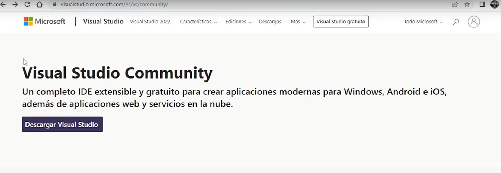
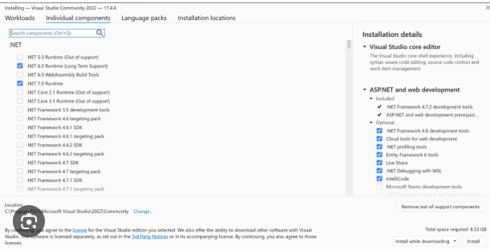
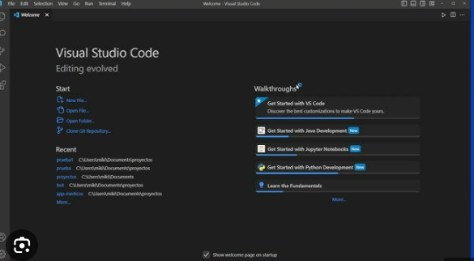
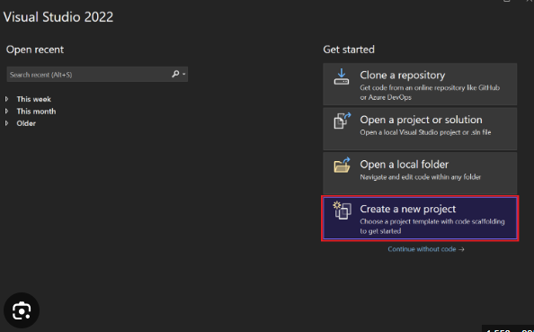

# Guía de Configuración de Entornos de Desarrollo

> 📋 **Guía Técnica**: Esta documentación establece los procedimientos para configurar un entorno de desarrollo en C# y otros lenguajes. Incluye las configuraciones necesarias para mantener consistencia en el desarrollo de software.

> **Nota importante**: Este documento se enfoca en aspectos técnicos y procedimientos. Para análisis comparativos, reflexiones personales y conclusiones, utiliza el archivo `CONCLUSIONES_EVALUACION.md`.

**Autores**: [Nombre 1] y [Nombre 2]
**Fecha V0**: [Fecha de entrega inicial]
**Fecha V1**: [Fecha de entrega final]

---

## Visual Studio Code - Entorno Principal

### Instalación y Verificación

**Método de instalación:** [Especifica el método recomendado]

> **💡 Sobre las imágenes**: Incluye capturas de pantalla para mostrar los diferentes pasos o resultados. Ejemplo: `

**Proceso de instalación:**
- **Descarga:** [Describir el proceso]
- **Opciones del instalador:** [Documentar las opciones que se consideraron importantes]
- **Verificación:** [Cómo verificar que funciona]

*Es posible documentar múltiples métodos.*

### Uso Básico de VS Code

**Navegación y funcionalidades básicas:**
- Navegación por la interfaz
- Edición de código
- Uso de la paleta de comandos
- Gestión de archivos y carpetas

### Personalización del Entorno

**Configuraciones aplicadas:** [Describir las personalizaciones que se realizaron]

*Ejemplos de configuraciones útiles (elegir las que se consideren relevantes):*

**Temas e iconos:**
Ejemplos:
- Material Theme, One Dark Pro
- File Icon Theme para mejor identificación de archivos

**Configuración de fuentes:**
Ejemplos:
- Fira Code, JetBrains Mono (con ligaduras)

**Atajos de teclado útiles:**
Ejemplos:
- Ctrl+/ para comentar/descomentar
- Ctrl+Shift+P para paleta de comandos
- Ctrl+` para terminal integrada
- Alt+↑/↓ para mover líneas

**Configuración del editor:**
Ejemplos:
- Formateo automático al guardar
- Detección automática de indentación
- Word wrap para líneas largas

**Terminal integrada:**
Ejemplos:
- PowerShell como terminal predeterminado
- Configuración de perfil personalizado

> **Personaliza según tus necesidades**: Estas son sugerencias basadas en prácticas comunes. Experimenta y documenta las configuraciones que encuentres más útiles para tu flujo de trabajo.> 💼 **Manual de Incorporación**: Esta guía establece los estándares del equipo para configurar entornos de desarrollo en C#. Cualquier nuevo desarrollador debe poder seguir estas instrucciones para configurar su entorno de trabajo de manera consistente con el resto del equipo.

### SDK .NET

**Proceso de instalación:**
1. **Descarga e instalación:** [Describir el proceso]
2. **Verificación:** [Cómo comprobar que funciona]

### Configuración para C#

**Extensiones esenciales:**
- **Soporte oficial para C#**: Extensión que proporciona IntelliSense, debugging y compilación


**Configuraciones específicas para C#:** 
[Describir las configuraciones que se aplicaron, como formateo automático, intellisense, o configuraciones del compilador]

**Debugging básico:**
- Configuración de puntos de interrupción (breakpoints)
- Ejecutar y depurar
- Inspección de variables

> **Enfoque práctico**: Concentra tu documentación en las funcionalidades básicas que usarás día a día.

### Flujo de Trabajo con C#

**Creación de proyectos:**
[Documentar el proceso para crear proyectos C#]

**Estructura de proyecto:**
```csharp
// Incluir aquí un ejemplo del código desarrollado
// Comentarios sobre las decisiones tomadas
```

**Compilación y ejecución:**
[Proceso para compilar y ejecutar proyectos]

**Debugging:**
[Configuración y uso de debugging]

---

## Visual Studio - IDE Alternativo

### Instalación

**Proceso de instalación:**
- **Descarga:** Dirígete a la página oficial de Visual Studio en (https://visualstudio.microsoft.com/es/) y descarga la versión Community, que es gratuita y suficiente para desarrollo en C#. 

    
- **Componentes necesarios:** Al abrir el instalador, selecciona la carga de trabajo Desarrollo de escritorio con .NET. Esta incluye todo lo necesario para crear y ejecutar aplicaciones en C#. Opcionalmente, puedes seleccionar ASP.NET y desarrollo web si planeas usar proyectos web más adelante.
  
      
- **Verificación:** Una vez finalizada la instalación, abre Visual Studio. En la ventana de inicio, haz clic en Crear un nuevo proyecto y verifica que aparece la opción Aplicación de consola (.NET Core / .NET 6/7/8). Si aparece, la instalación se ha realizado correctamente.
  
    

### Desarrollo con C#

**Creación de proyecto:**

1. Abre Visual Studio.

2. Selecciona Crear un nuevo proyecto.

3. Filtra por C# y selecciona Aplicación de consola (.NET).

4. Asigna un nombre al proyecto y selecciona la ubicación.

5. Haz clic en Crear.

    

**Flujo de trabajo básico:**
- Compilación y ejecución:
Pulsa Ctrl + F5 para ejecutar sin depurar o F5 para ejecutar con depuración.

- Uso de Solution Explorer:
Aquí puedes navegar entre archivos del proyecto, referencias y dependencias.

- Debugging básico:
Coloca breakpoints en el código y usa el panel de depuración para inspeccionar variables y controlar la ejecución.

---

## Configuración de Lenguaje Adicional

**Lenguaje seleccionado:** Python - **Justificación:** Lenguaje ampliamente usado para desarrollo rápido, scripting, ciencia de datos y automatización.

### Instalación del Entorno

**Runtime/SDK:**
- **Descarga e instalación:** 

  - Dirígete a [[Enlace](https://www.python.org/downloads/)]

  - Descarga la última versión estable.

  - Asegúrate de marcar la opción Add Python to PATH durante la instalación.


- **Verificación:** 

    - Abre una terminal y ejecuta:

            python --version


    - Debe mostrar la versión instalada.


### Configuración en VS Code

**Extensiones por lenguaje:**

*Para Python:*

- Python : Incluye soporte completo de intérprete, linting, debugging y Jupyter Notebook.

- Configuraciones específicas aplicadas:

    - Selección del intérprete: Ctrl+Shift+P → Python: Select Interpreter

    - Formateo automático: Activar Format On Save

    - Linting: Activar Pylint para mejorar calidad de código

### Proyecto de Ejemplo ###

**Código desarrollado:**
```
# HolaMundo.py
# Programa sencillo que imprime un mensaje en pantalla

def main():
    print("¡Hola, mundo!")

if __name__ == "__main__":
    main()
```

**Proceso de ejecución:**

1. Abre el archivo HolaMundo.py en VS Code.

2. Pulsa F5 para ejecutar con debugging o Ctrl+F5 para ejecutar sin debugging.

3. Observa la salida en la terminal integrada.

---

## Configuraciones Recomendadas

**Configuraciones generales:**
- Activar autosave y formateo automático

- Configurar tema oscuro y tipografía clara

- Ajustar tamaño de fuente y espaciado de tabulación según preferencia

**Herramientas adicionales:**
- Git y GitHub para control de versiones

- Extensiones de snippets y productividad (ex: Prettier, Bracket Pair Colorizer)

**Solución de problemas comunes:**
- Problema: VS Code no detecta Python

    - Solución: Ctrl+Shift+P → Python: Select Interpreter y elegir la ruta correcta

- Problema: Error al ejecutar C#

    - Solución: Verificar que la carga de trabajo de .NET está instalada correctamente

**Recursos útiles:**
- [[Enlace](https://learn.microsoft.com/es-es/visualstudio/?view=vs-2022)]: Guía completa sobre instalación, configuración, depuración y desarrollo de proyectos en Visual Studio, incluyendo tutoriales y referencias de C#.
  
- [[Documentación](https://learn.microsoft.com/es-es/visualstudio/?view=vs-2022)]: Referencia oficial del lenguaje Python, con tutoriales, librerías estándar, ejemplos de código y buenas prácticas de programación.

---
